# ERU - Day 1 Worksheet

**Welcome to Electronics for the Rest of Us!**  
<br>

Thanks for being a part of this module. Over the next four days, we'll be working together to explore some fundamental concepts in electronics, programming, and version control--all while building some small but interesting devices! 

This module assumes no prior knowledge or experience with electronics or programming--we'll start simple and see how far we get!

This module will use a mix of asynchronous and synchronous activities, which will (hopefully) allow you to work at your own pace (and on your own schedule), while interacting with, supporting, and getting support from me and your peers. All of the materials for this module will be provided to you in both written and video formats--all of which will be presented on these webpages. For communication purposes, we'll use Microsoft Teams.  

## Learning Objectives
By the end of this module, you will be able to:  
- Explain the fundamental concepts and operational principles of simple circuits, sensors and actuators
- Apply fundamental principles to build simple circuits that interact with their surrounding environments
- Create and modify software code to control the device and create comments to document its functionality
- Apply your skills, knowledge and creativity in the process of creating an original electronic device
- Use Markdown to format text in a simple yet effective manner
- Create, edit, and version control files in a GitHub repository
- Use GitHub Pages to share your results on an openly-accessible webpage

## Part 1: Introduction to the module

The following introductory slideshow will be presented by Jay during the opening class. It provides an overview of the module, its components, expectations, and deliverables. 

<iframe src="https://docs.google.com/presentation/d/e/2PACX-1vRGF9iiknpFD8UbYc0AZwdgcNO8SvpcMJ73Y5ASyecBScyvJuylV-xTP95J_hA42YNe1FkxRFMuXxhE/embed?start=false&loop=true&delayms=15000" frameborder="0" width="640" height="389" allowfullscreen="true" mozallowfullscreen="true" webkitallowfullscreen="true"></iframe>

<br>
[View slides in PDF format](slides.pdf)
<br>


## Part 2: Intro to Arduinos, Sensors, and Actuators

Follow along with this short presentation of the types of electronic components we'll be using in this module. Feel free to unpack your kit and check out the components.

<iframe src="https://docs.google.com/presentation/d/e/2PACX-1vRGF9iiknpFD8UbYc0AZwdgcNO8SvpcMJ73Y5ASyecBScyvJuylV-xTP95J_hA42YNe1FkxRFMuXxhE/embed?start=false&loop=true&delayms=15000" frameborder="0" width="640" height="389" allowfullscreen="true" mozallowfullscreen="true" webkitallowfullscreen="true"></iframe>


## Part 3: Getting Started
Now that you've unpacked your kit, it's time to plug in your Arduino and begin using it. 
### Physically connect the Arduino
- The Arduino can use the USB port to communicate with your computer, as well as draw power from is. Use the USB cable provided to connect the Arduino to your computer's USB port. If done correctly, the on-board LED labeled "**ON**" should light up. If this doesn't work, disconnect and attempt again. 
- Depending on what program was uploaded to your Arduino board last, you may or may not see the on-board LED lalebeled "**L**" light up or flash. Arduinos will run its uploaded program upon power-up, and will continue to do so until the *reset* button is pressed, the power is disconnected, or the board breaks. 
  - Note that the on-board LED lalebeled "**L**" is connected to digital input/output (IO) pin number 13; if the current program provides instructions for current to be provided to pin 13, it'll be reflected in the on-board LED (whether or not anything is connected to digital pin 13. 
  
### Open the Arduino IDE; Connect to the Arduino board
Once your Arduino is physically connected to your computer, open up the Arduino IDE program. A new sketch window will appear. The sketch window contains a number of different areas, which are labeled below. You'll learn and use these functions througout the module.

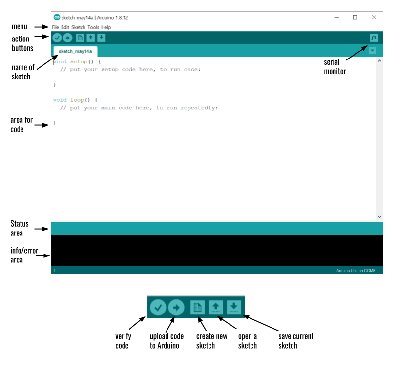

Depending on your operating system, your Arduino may or may not be connected via a serial port (which allows for communication between the computer and the Arduino). 
- You can check the status of your connection by clicking on >Tools>Port. 

A physically connected Arduino should appear in the Serial Ports list as **COMX (Arduino UNO)** as shown below:

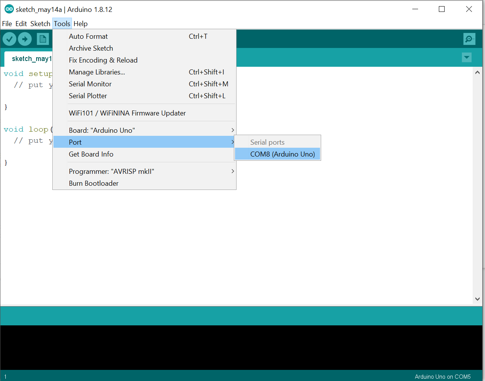

To establish the serial connection, click on the listed COM port that where the Arduino is connected. A checkmark should appear beside the port when a connection has been made.
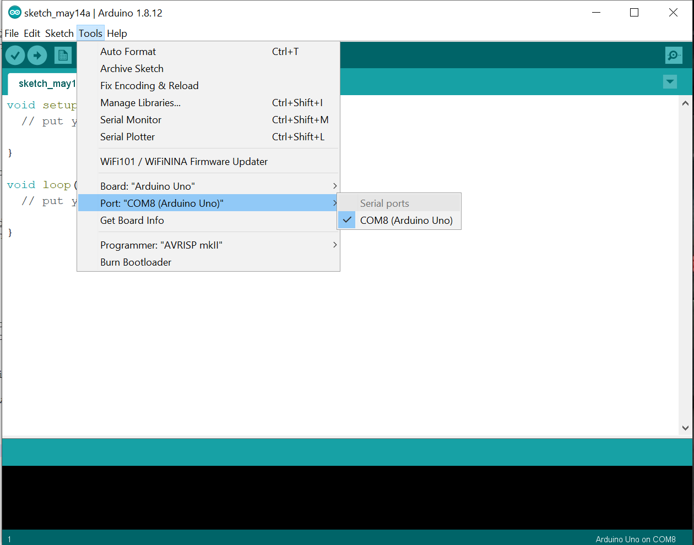

## Part 4: Uploading and running a program

### Open the program "Blink"
In this exercise, you are going to upload your first program to the Arduino. For this case, we'll use one of the example programs that come with the Arduino IDE.
- Go to >File>Examples>0.1Basics> and click on **Blink**. This will open up a new sketch (what Arduino calls its programs) with the Blink program. 

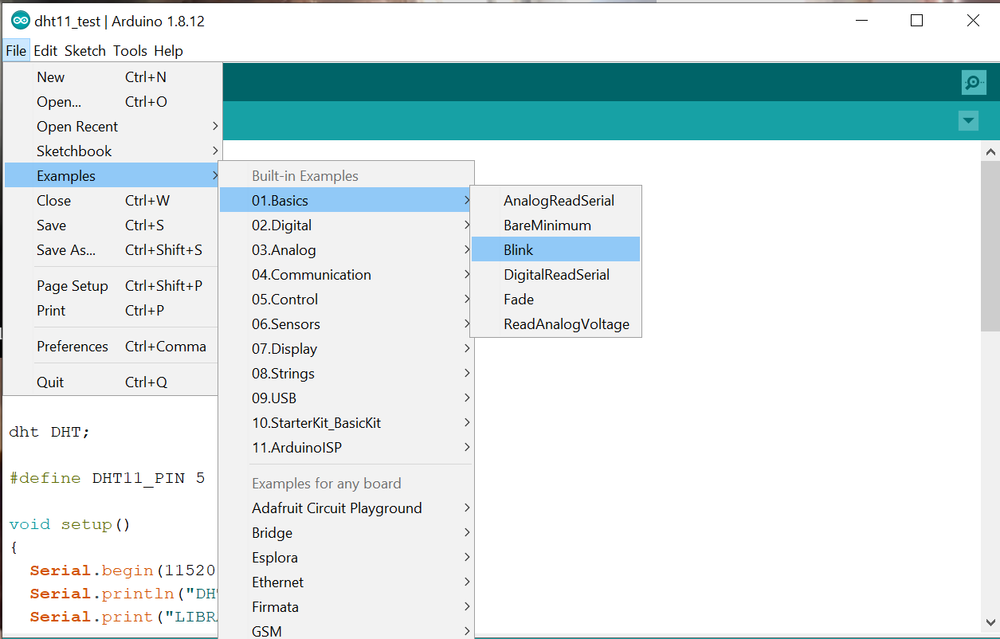

### Upload "Blink" to the Arduino
- Ensuring that the Arduino is connected (both physically and through the COM port), click the upload button. 
  - The status window should first indicate that it is *Compiling sketch*, and then indicate that it is *Uploading*.
- If the upload was succesful, the status window will indicate *Done uploading*, and the info window will communicate the following (or similar):
```
Sketch uses 924 bytes (2%) of program storage space. Maximum is 32256 bytes.
Global variables use 9 bytes (0%) of dynamic memory, leaving 2039 bytes for local variables. Maximum is 2048 bytes.
```
#### Question: 
What is happening on your Arduino board 


- If an error occurs, the status window will provide a general error message, and the info window will give additional information on it (you may need to scroll to see it). 
  - If the error occurred when uploading (i.e. a connection couldn't be made between the computer and the Arduino), the status window will read: *An error occurred while uploading the sketch*. 
  - If the error occurred when compiling the code (i.e. there's something wrong with your code), the status window will provide an error message, and the problematic line will be highlighted in the sketch. 

## Part 5: Understanding an Arduino sketch
The blink sketch provides a good opportunity to explore the three fundamental elements of an Arduino sketch. 

### The commented preface
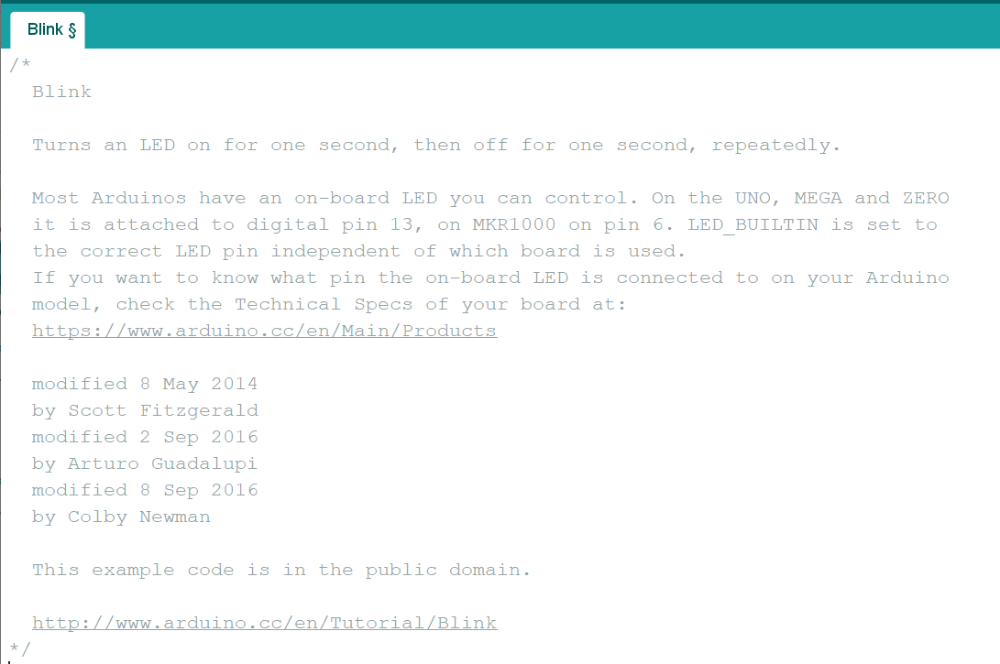

The opening, grey-text section of the sketch is a block comment that contains human-readable information about the program. This section is ignored by the Arduino compiler, and its sole purpose is to provide humans (whether yourself or others) with more information on the code. Comments can be inserted into a sketch as a block using the ```/*``` and ```*/``` characters around the commented text, e.g:
```
/* 
All of this is 
a comment
*/
```

Comments are an important part of writing and maintaining computer code, as it's often much easier to understand what the code is doing when there is plain, human-readable text accompanying it. It's also important to record your changes over time. Additionally, you can use comments to temporarily remove certain lines of code that you don't want to be executed.

A good commented preface should contain some/all of the following information:
- What the code does.
- A description (or link to a diagram) of the circuit that it works alongside. 
- Links to any other information.
- Who created it, revised it, and when this was done.
- Information on licensing / rights on the code.


You'll also notice later in the sketch that comments are inserted on single lines (whether at the start or end) using the ```//``` characters: 
```
// This is a commented line
```

### The setup function
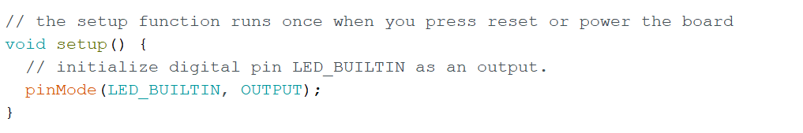

As mentioned in the comment above it, the setup function runs a single time when the board is turned on, reset, or when a new program is uploaded to it. The purpose of the setup function is to declare constants and run commands that configure the Arduino board to operate as desired in the following loop function. 

Note the general structure of a function used for the setup function (and other functions):

```
<returned_value> <name of function> (<input values>){
first command; //commands end with a semicolon
second command;
third command;
...
} // curly braces contain the commands at the top and bottom
```

In this casee, there is no returned value (the term ```void``` is used to indicate this), the name of the function is *setup*, there are no input values (thus the empty parentheses), and there is only one command executed.

#### Q1: 
- In this example, the only command executed in the setup function is ```pinMode(LED_BUILTIN, OUTPUT);```. What does this line do? 

#### A1: 
- ```pinmode``` is a built-in function that allows you to determine whether a given digital pin should be *INPUT* (receives current) or *OUTPUT* (delivers current). 
- The first *argument* to the function, ```LED_BUILTIN``` is a built-in constant that refers to digital pin 13, which is connected to the built-in LED on the Arduino board (labelled **"L"**). Note that you could replace ```LED_BUILTIN``` with ```13``` and it would work just the same. 
- The second *argument*, ```OUTPUT```, indicates that digital pin 13 should be set to output current.

### The loop function
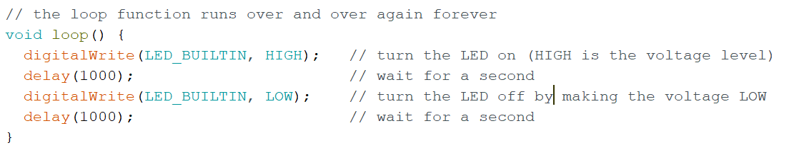

As also indicated in the preceding comment, the loop function will run repeatedly for as long as the Arduino board is powered and operational. The loop function uses the same form as described above, and contains four lines of executed commands. 

#### Q2:
- What instructions are each of these lines providing to the Arduino board?

## Part 6: Modifying a sketch
Modify the Blink code so that the onboard LED blinks at a different frequency. **Remember** to save your code and upload it to the Arduino after you've modified it.

- How fast can you make it blink? 
- Can you make it blink at always-differing intervals? 

## Part 7: Inserting an LED
If you recall from earlier, the on-board LED (indicated by ```LED_BUILTIN``` in the Arduino code) is also connected to digital pin 13 on your Arduino board. You can connect an LED to this pin in a circuit by connecting one leg to digital pin 13 and the other to the adjacent pin labeled **GND**.
- The **GND** is the *ground* connection of the circuit. Circuits require a higher- and lower-voltage connection to permit current to pass through it. The ground pin often serves this purpose. In this case, digital pin 13 serves as the higher-voltage connection, and current flows from pin 13, through the LED and toward GND. 
- Try connnecting one of your standard (two-legged) LEDs. If it doesn't work, turn it around and connect it the other way. 

#### Question: 
- What happened? Did it work in both directions? 

#### Answer: 
- You probably noticed that it only worked in one direction. This is because an LED is a uni-directional device. Current must enter through the anode (connected to pin 13 in this case) and leave through the cathode (connected to GND in this case) for light to be generated. 
- The anode and cathode can usually be identified with a couple of visual queues: The anode has a longer leg, and the cathode has a flattened plastic bottom brim. 


## Part 8: Reviewing our circuit
So, you may be asking yourself at this point: *"Is that the proper way to connect that LED?"*. This is an excellent question. To find the answer:
- Navigate to the [Arduino tutorial page for Blink](https://www.arduino.cc/en/Tutorial/Blink) (which is provided in the comments of the Blink code)
- Note the hardware required
- Scroll down to view the circuit diagram. **What's missing from our current circuit?**

Before we move forward, you'll need to understand how to identify the proper resistor to place into the circuit. 

### Resistors 
Resistors are important elements of circuits, as they control the flow of current through a circuit. This may be necessary to ensure that a connected device works properly, or to protect it from being damaged by current that is too high. The higher the resistance of a resistor, the more current is restricted through it. The unit of resistance is referred to as the ohm (symbol &#937). Resistors use colour codes to indicate their resistance value--these may be communicated using 4- 5- or 6-band systems. 

Here's a diagram demonstrating the 4- and 5-band systems: 
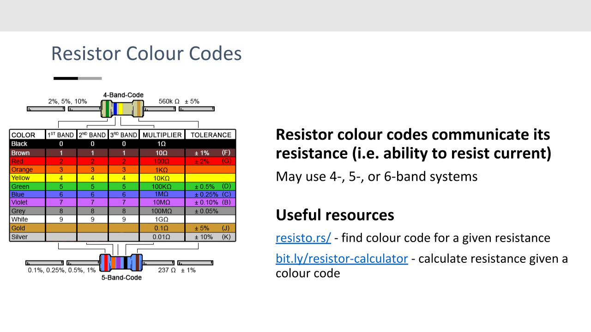

And here's a further explanation of the examples: 
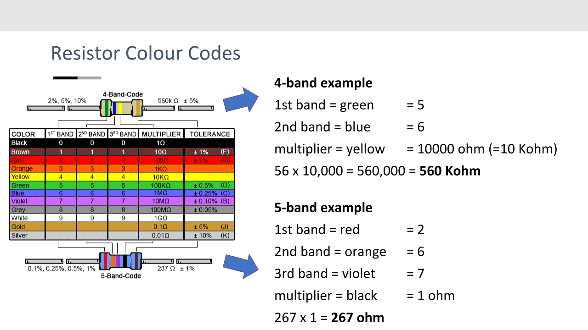

#### Question 1
Use the colour code above to answer the following questions: 
- What colour code would be found on a 10 Kohm (10000 ohm) resistor using: 
  - Four bands?
  - Five bands?

#### Answer 1
Use [resisto.rs](http://resisto.rs/) to assess your answer (enter ```10K``` into the box). A resource like [resisto.rs](http://resisto.rs/) is useful when you have a desired resistance and want to know the colour code.

#### Question 2
Identify all of the 10 Kohm resistors in your kit
- ***Hint***: there may be a mix of 4- and 5-band codes used

#### Question 3
Use the colour code chart to identify the resistance of the other resistors in your kit (hint: the rest all have the same resistance and all use a 4-band colour code).
- ***Hint:*** Use a resistor colour code calculator like [this](https://www.digikey.ca/en/resources/conversion-calculators/conversion-calculator-resistor-color-code-4-band) to assess your answer. These kind of calculators are useful when you have a resistor in hand (i.e. you know the colour code), and need to know its resistance.

## Part 9: Building a proper circuit
Now that you've properly identified the resistor you need for this circuit, how are you going to connect the pieces?
- You could attempt to twist the wires together, but you might break something and it won't be very reliable
- You could solder the pieces together, but we're just experimenting here. 
- **To connect this circuit, we're going to use a solderless breadboard**

### Solderless breadboard**
The solderless breadboard allows you to create circuits quickly without the need for soldering connections together. 
- Metal strips run through the backside of the breadboard, which connect specific rows and columns together in a defined manner: 

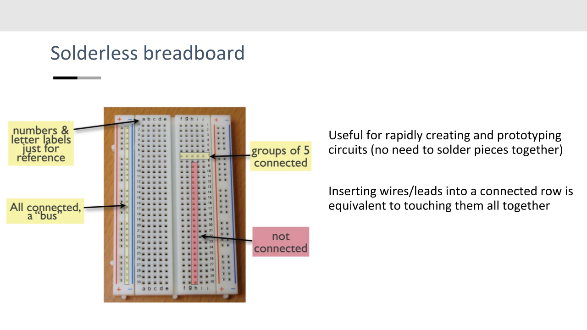

Note in the example above that connections run horizontally across rows of 5 on the inner part of the breadboard, while connections run vertically down the outside columns. 

#### Your tasks:
Create the proper blink circuit using: 
- The solderless breadboard
- The LED from the first circuit
- An appropriate resistor
- Jumper cables to connect the breadboard to the Arduino pins.
When you've succeeded, save your sketch to your local working folder with an appropriate name.

## Part 10: Using a button
In this example, you'll use a button to turn your LED on (when pushed) and off (when not pushed).

#### Your tasks: 
- Open the Button sketch from the Arduino IDE at >File>Examples>0.2Digital> and click on **Button**
- Navigate to the Arduino [Button tutorial page](https://www.arduino.cc/en/Tutorial/Button) to find the hardware requirements and circuit diagram.
- Take a close look at the code, and try to make sense of the code.

#### Notes
1. This example uses the on-board LED at pin 13. If you'd like, leave your LED circuit wired into the breadboard from the Blink example--it'll light up when you push the button. 
2. **How the button works**: The opposing legs of a button are connected to each other internally. When the button is not pushed in, the two sets of legs are not connected to each other. When the button is pushed, a metal gate closes to connect the two legs together, allowing current to flow from left to right across the button
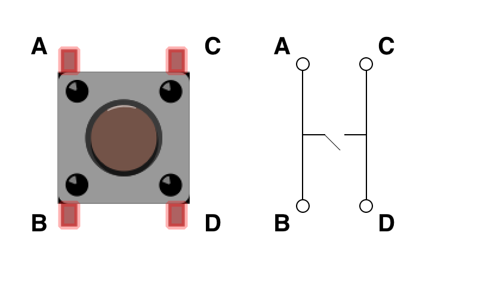
3. The 10K resistor serves as a pull-down resistor in this example, as it ensures that digital pin 2 is kept at LOW when the button is not pressed. Otherwise, the input may 'float', returning LOW and HIGH randomly, causing the LED to also blink randomly.  
4. This example declares both constants (values that won't change) and variables (values that may). 
  - The line ```const int buttonPin = 2;``` creates a constant (*const*) named *buttonPin* that is an integer (*int*, as opposed to other types--see [here](https://www.arduino.cc/en/Reference/VariableDeclaration) for more information), which has a value of 2. 
  - The line  ```int buttonState = 0;``` creates a variable named *buttonState* that is an integer with an initial value of 0.
5. In the line ```buttonState = digitalRead(buttonPin);```, the function *digitalRead* is used to read the state of the button on pin 2 (which is the value of buttonPin). The result (HIGH or LOW) is saved to the variable *buttonState*. 
6. An *if* statement is used to control the output on the ledPin (digital pin 13) depending on the value of *buttonState*.
  - An if statement takes the general form: 
```
if (condition1) {
  // do Thing A
}
else if (condition2) {
  // do Thing B
}
else {
  // do Thing C
}
```
See the [Arduino if-else reference guide](https://www.arduino.cc/reference/en/language/structure/control-structure/else/) for more information. 

## Part 11: Using a potentiometer
In this example, you'll use a potentiometer (dial) to control the brightness of your LED. 

#### Your tasks:
- Open the AnalogInOutSerial sketch from the Arduino IDE at >File>Examples>03.Analog> and click on **AnalogInOutSerial**
- Navigate to the Arduino [AnalogInOutSerial tutorial page](https://www.arduino.cc/en/Tutorial/AnalogInOutSerial) to find the hardware requirements and circuit diagram. **Note** that you'll need to connect your circuit using the solderless breadboard.
- Once you've connected your circuit and succesfully uploaded your code, open up the serial monitor on the top-right of the IDE. 
- Adjust (turn) the potentiometer and observe the changes to the LED, as well as the output in the Serial Monitor.

#### Notes
1. In this example, the LED is connected to digital pin 9, which is one of six **pulse width modulation (PWM)** digital pins on the Arduino (denoted with a **"~"** symbol on the board). PWM allows a digital output (which is either LOW = OFF or HIGH = ON) to simulate an analog signal (which can assume any value between LOW and HIGH). The command ```analogWrite``` is used instead of *digitalWrite* in this case, since we're writing an analog value to pin 9.

2. The map function is very useful for scaling the range of one variable to another range. In this example, the analog signal (from the potentiometer) ranges between 0 and 1023, while the acceptable output range for the LED is 0 to 255. The map function proportionally scales the potentimeter value to a usable value for the LED. 
3. In this example, you've used the Serial Console to establish and carry out serial communication between the Arduino and the computer. The setup function line ```Serial.begin(9600);``` establishes the connection, and the input argument (9600) in this case, determines the rate of information transfer, also known as the *baud* rate (9600 kilobits per second in this case). Clicking the dropdown on the bottom-right of the Serial Console displays the different baud rates that can be used. Note that the baud rate stated in the code needs to match that set in the Serial Console to receive intelligible output.

## Part 12: Potentiometer out, photoresistor in
In this example, we’re going to work from the code and wiring from the previous example, and replace the potentimeter with a photoresistor. The point of this is to demonstrate how both of these items can be used as control devices by providing variable resistance. 

#### Your tasks:

#### Notes


